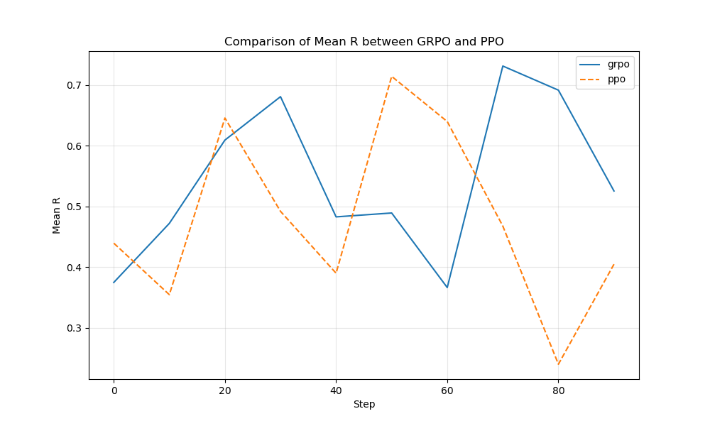

# nanoGRPO – a **tiny, from-scratch** implementation of GRPO on top of nanoGPT  
<small>Gradient-Reweighted Preference Optimisation • PyTorch ≥ 2.2 • single-GPU friendly</small>

---

## Why GRPO?

GRPO (DeepSeek-AI et al., 2025) is a lightweight alternative to PPO-RLHF:

|            | PPO-RLHF | **GRPO** |
|------------|----------|-----------|
| Models you need | 🟢 Policy<br>🟢 **Value**<br>🟢 Reward<br>🟢 Reference | 🟢 Policy<br>🟢 Reward<br>🟢 Reference |
| Advantage source | Monte-Carlo return − value | **Batch z-score of rewards** |
| GPU RAM | 4× policy size | **≈½ PPO** |
| Sample efficiency | Good | Slightly better (one pass per batch) |

The craft is in computing a **stable, unbiased policy gradient** without the extra value network.  
That's what `grpo.py` demonstrates in ≤ 40 lines of math.

---

## Results

Here are the comparison plots showing the performance of GRPO vs PPO:

### Reward Comparison


### KL Divergence Comparison


### Entropy Comparison


### Loss Comparison


---

## File map (minimal subset)

grpo.py            # <- core loss  (token-level)
train_grpo.py      # driver: SFT->GRPO
reward_model.py    # tiny GPT-style scalar RM
ppo.py, train_ppo  # side-by-side PPO baseline
utils/metrics.py   # CSV logger
utils/plot_metrics # reward / entropy / |adv| curves

`train_grpo.py` expects you already ran nanoGPT's **SFT** step, producing a `policy.pth` that doubles as the *reference* π₀.

---

## Implementation Nuances  🚧

| Pitfall | Where it lives | What we do |
|---------|----------------|------------|
| **Token vs sequence KL** – exact KL needs the full distribution for every token. | `grpo.py` line 17 | We use **sequence KL**: `KL ≈ log π_seq − log π₀_seq`. Fast, but only an approximation. Good enough for small models; bump `kl_coef` up if the policy drifts. For variable-length completions, normalize by sequence length or apply a mask to prevent long answers from dominating the KL. |
| **Proxy entropy** – calling `logp.exp()` only sees the sampled token, under-estimating entropy. | `grpo.py` lines 11-14 | Kept for *logging only* and represents a lower bound. The entropy plots thus show conservative estimates. If you want an entropy **bonus** in the loss, compute it from **full logits** (commented snippet included). |
| **Length bias** – summing log-probs favors long completions. | `kl = … logp_tokens.sum(-1)` | For variable-length tasks, pass a mask or divide by *T*. Shakespeare toy uses fixed length, so it's fine by default. |
| **Detached reference** – if gradients leak into the frozen π₀ weights, training explodes 🙀 | `logp_ref = … with torch.no_grad()` | We add `.detach()` inside the KL line to be bullet-proof. |
| **Zero-variance rewards** – early batches can have identical rewards → `std=0`. | `adv = (r-μ)/(σ+ε)` | Tiny `eps=1e-8` avoids NaNs; wrap in `torch.nan_to_num` for extra safety. |
| **PPO simplifications** – our baseline intentionally omits some standard PPO features. | `ppo.py` | The PPO implementation uses direct reward bootstrapping without GAE/discounting, which slightly handicaps it versus standard implementations. This is fine for toy examples but worth noting for production use. |

## Plot Improvements 🖼️

For better visualization:
- Add axis labels to the plot PNGs so they remain self-describing when shared out of context
- For entropy plots, remember they show a lower bound (sampled-token entropy)
- CSV headers are aligned with plot scripts for easy experimentation

---

## Quick start (tiny Shakespeare)

```bash
git clone https://github.com/asimkadav/nanogrpo.git && cd nanogrpo
pip install torch>=2.2 pandas matplotlib

# Run the demo script to see GRPO in action
python rlhf_demo.py

# Or try the full example
python run_example.py
```

### Or if you want to run individual steps:

```bash
# 1️⃣ Generate training data
python simple_example.py

# 2️⃣ Train with GRPO
python train_grpo.py

# 3️⃣ Train with PPO (for comparison)
python train_ppo.py

# 4️⃣ Plot learning curves
python plot.py --metric mean_r logs/grpo.csv logs/ppo.csv
python plot.py --metric kl logs/grpo.csv logs/ppo.csv
python plot.py --metric entropy logs/grpo.csv logs/ppo.csv
```

---

## Reading list
- DeepSeek-AI et al., "DeepSeek-R1: Incentivizing Reasoning Capability in LLMs via Reinforcement Learning," [arXiv:2501.12948](https://arxiv.org/abs/2501.12948) (2025)
- Original blog: "Why GRPO Is Important and How It Works," Oxen.ai, Feb 2025
- DeepSeek-R1 code drop – real-world GRPO implementation in the wild

---

Pull requests & issues welcome — enjoy hacking!