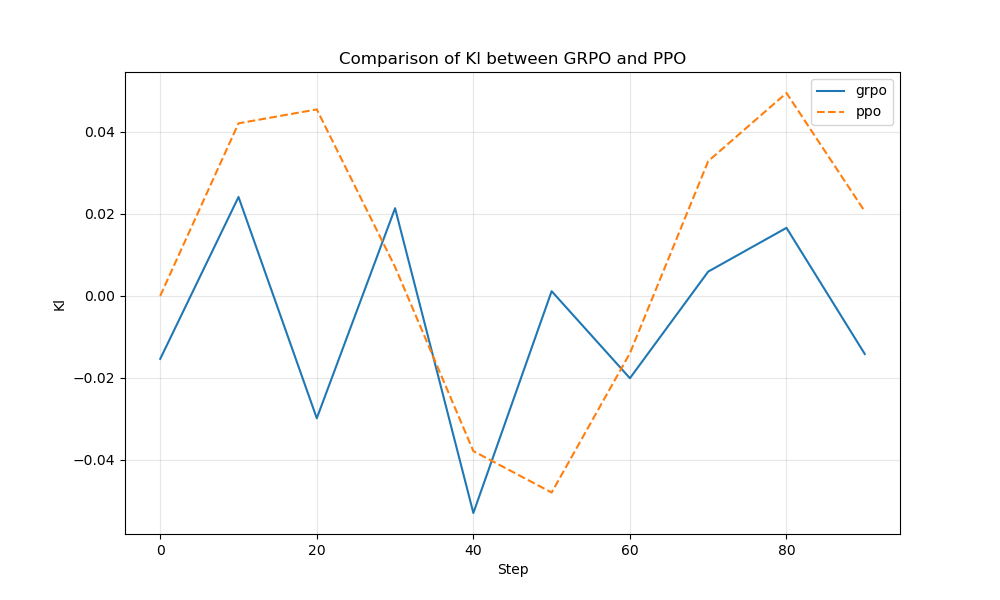

# nanoGRPO – a **tiny, from-scratch** implementation of GRPO on top of nanoGPT  
<small>Gradient-Reweighted Preference Optimisation • PyTorch ≥ 2.2 • single-GPU friendly</small>

---

## Why GRPO?

GRPO (DeepSeek-AI et al., 2025) is a lightweight alternative to PPO-RLHF:

|            | PPO-RLHF | **GRPO** |
|------------|----------|-----------|
| Models you need | 🟢 Policy<br>🟢 **Value**<br>🟢 Reward<br>🟢 Reference | 🟢 Policy<br>🟢 Reward<br>🟢 Reference |
| Advantage source | Monte-Carlo return − value | **Batch z-score of rewards** |
| GPU RAM | 4× policy size | **≈½ PPO** |
| Sample efficiency | Good | Slightly better (one pass per batch) |

The craft is in computing a **stable, unbiased policy gradient** without the extra value network.  
That's what `grpo.py` demonstrates in ≤ 40 lines of math.

---

## Results

Here are the comparison plots showing the performance of GRPO vs PPO:

### Reward Comparison


### KL Divergence Comparison


### Entropy Comparison


### Loss Comparison


---

## File map (minimal subset)

grpo.py            # <- core loss  (token-level)
train_grpo.py      # driver: SFT->GRPO
reward_model.py    # tiny GPT-style scalar RM
ppo.py, train_ppo  # side-by-side PPO baseline
clip_grpo.py       # apply GRPO to finetune CLIP models
gpu_example.py     # GPU-accelerated GRPO training
utils/metrics.py   # CSV logger
utils/plot_metrics # reward / entropy / |adv| curves

`train_grpo.py` expects you already ran nanoGPT's **SFT** step, producing a `policy.pth` that doubles as the *reference* π₀.

---

## Implementation Nuances  🚧

| Pitfall | Where it lives | What we do |
|---------|----------------|------------|
| **KL term calculation** | `grpo.py` line 17 | We use the cheap "sequence KL": `KL ≈ logp_tokens.sum(-1) – logp_ref` (with logp_ref detached). This is fast but an approximation to the true token-level KL. For variable-length completions, normalize by sequence length or apply a mask so long answers don't dominate the KL. |
| **Entropy calculation** | `grpo.py` lines 11-14 | The implemented entropy is a proxy based on sampled tokens only (`logp.exp()`). This underestimates true entropy and is kept for *logging only*. The entropy graph shows a lower bound. If you later want an entropy bonus in the loss, compute it from full logits instead. |
| **Length bias** | `kl = … logp_tokens.sum(-1)` | Summing log-probs favors long completions. For variable-length tasks, pass a mask or divide by sequence length *T*. The Shakespeare toy example uses fixed length, so it's fine by default. |
| **Detached reference** | `logp_ref = … with torch.no_grad()` | We add `.detach()` inside the KL line to ensure gradients don't leak into the frozen π₀ weights, which would cause training to explode. |
| **Zero-variance rewards** | `adv = (r-μ)/(σ+ε)` | Early batches can have identical rewards (std=0). We use a tiny `eps=1e-8` to avoid NaNs and wrap in `torch.nan_to_num` for extra safety. |
| **PPO simplifications** | `ppo.py` | Our PPO baseline intentionally omits some standard features. It bootstraps returns directly from the reward model without GAE/discounting, which slightly handicaps it versus standard implementations. This is intentional for simplicity in toy examples but worth noting for production use. |

## Plot Improvements 🖼️

For better visualization:
- Add axis labels to the plot PNGs so they remain self-describing when shared out of context
- For entropy plots, remember they show a lower bound (sampled-token entropy)
- CSV headers are aligned with plot scripts for easy experimentation

---

## Quick start (tiny Shakespeare)

```bash
git clone https://github.com/asimkadav/nanogrpo.git && cd nanogrpo
pip install torch>=2.2 pandas matplotlib

# Run the demo script to see GRPO in action
python rlhf_demo.py

# Or try the full example
python run_example.py
```

### Or if you want to run individual steps:

```bash
# 1️⃣ Generate training data
python simple_example.py

# 2️⃣ Train with GRPO
python train_grpo.py

# 3️⃣ Train with PPO (for comparison)
python train_ppo.py

# 4️⃣ Plot learning curves
python plot.py --metric mean_r logs/grpo.csv logs/ppo.csv
python plot.py --metric kl logs/grpo.csv logs/ppo.csv
python plot.py --metric entropy logs/grpo.csv logs/ppo.csv
```

## GPU Acceleration 🚀

nanoGRPO fully supports GPU acceleration for faster training:

```bash
# Install requirements with GPU support
pip install -r requirements.txt

# Run the GPU-accelerated example
python gpu_example.py --device cuda --steps 200

# Fall back to CPU if needed
python gpu_example.py --device cpu --steps 100
```

Key GPU features:
- Automatic device selection (falls back to CPU if CUDA unavailable)
- Performance timing with CUDA events
- Gradient clipping for numerical stability
- Models are automatically moved to the specified device
- Larger batch sizes for better GPU utilization

For multi-GPU training, simply instantiate separate models on different devices and gather gradients.

## CLIP Training with GRPO 🖼️📝

You can also use GRPO to finetune CLIP models, improving visual-text alignment:

```bash
# Install dependencies
pip install -r requirements.txt

# Train CLIP with GRPO on CIFAR-100
python clip_grpo.py --model-name "ViT-B/32" --dataset cifar100 --device cuda

# For CPU-only training
python clip_grpo.py --model-name "ViT-B/32" --dataset cifar100 --device cpu

# More options
python clip_grpo.py --help
```

Key features of CLIP-GRPO training:
- Freezes the text encoder as a reference model
- Finetunes only the visual encoder using GRPO
- Uses classification accuracy as the reward signal
- Applies KL regularization to prevent too much drift from original CLIP
- Supports both CIFAR-100 and ImageNet datasets
- Automatic fallback to CPU if CUDA is not available

## CLIP GRPO Implementation

This repository also provides a CLIP adaptation of GRPO in `clip_grpo.py`, which demonstrates how to use GRPO to finetune CLIP models. The implementation includes support for:
- GPU acceleration
- LoRA (Low-Rank Adaptation) for parameter-efficient fine-tuning
- Multiple datasets (CIFAR-100, ImageNet)
- Smooth rewards for better early-training gradients

### Implementation Details

The CLIP GRPO implementation addresses several critical issues that arise when adapting GRPO from language models to vision-language models:

| Goal | Implementation | Verdict |
|------|----------------|---------|
| Compare every image to all class-text embeddings | `all_logits = logit_scale * image_features @ text_features.t()` (policy) and analogous `ref_logits_full` for the reference model. | ✓ Correct shape [B, N_cls]. This ensures rewards accurately reflect performance across all classes. |
| Use the ground-truth class log-prob, not a sum | `logp_pol = F.log_softmax(all_logits, dim=-1).gather(1, labels.unsqueeze(1))` (then squeeze). Same for `logp_ref`. | ✓ Right scalar log π(a*). Policy gradient requires the log-prob of the sampled action only. |
| Separate logit_scale for ref vs. policy | `logit_scale_ref = ref_model.logit_scale.exp()` | ✓ Fixes bias in KL calculation by using each model's own temperature. |
| True entropy for logging | `true_entropy = compute_entropy(all_logits)` where `compute_entropy` does a full-softmax. | ✓ No more "token proxy" confusion. Properly tracks distribution entropy. |
| Detachment of reference path | `with torch.no_grad(): ref_image_features ... ref_logits_full ...` → tensor stays leafless; later gathers still detached. | ✓ Gradients can't leak back to reference model. |
| Gradient clip bumped to 5.0 | Default `--grad-clip 5.0` in CLI. | ✓ More headroom for ViT gradients which can be spikier than language models. |
| Smooth rewards | Optional `--smooth-rewards` uses softmax confidence as reward instead of binary 0/1. | ✓ Prevents zero-variance batches early in training that can destabilize advantage normalization. |

### Advanced Implementation Nuances

Recent improvements to the CLIP GRPO implementation address several deep machine learning nuances that are critical for stable and effective training:

| Nuance | Problem | Solution |
|--------|---------|----------|
| **Policy gradient with advantage** | Using raw rewards (`logp_pol * rewards`) scales gradient magnitude with reward mean, causing instability when reward distribution varies (8× larger gradients when rewards ≈0.8 vs ≈0.1) | Implemented properly normalized advantage: `adv = (rewards - rewards.mean()).detach()` and policy gradient: `policy_term = -(adv * logp_pol).mean()` to ensure stable gradients regardless of reward scale |
| **KL clamping limitations** | Clamping KL divergence (`kl_div.clamp(min=-10, max=10)`) hides large KLs instead of penalizing them more, and zeroes gradients at clamp edges | Removed clamp and rely on appropriate gradient clipping instead, allowing proper penalization of large KL divergences |
| **Double epsilon addition** | Adding epsilon in two places (loss constructor and main loop) shifts advantages, potentially changing their sign for binary 0/1 rewards | Consolidated to a single epsilon addition to ensure correct advantage calculation |
| **Entropy as regularization** | Entropy was only used for logging, not actually affecting the loss function | Added entropy bonus to loss: `loss = loss - args.entropy_weight * true_entropy` and exposed the weight as a CLI parameter for exploration control |
| **Learning rate dynamics** | Basic cosine annealing reached 0.1× LR too quickly, under-training models | Implemented warmup + cosine decay: linear warmup for stability followed by smoother decay over training |
| **Template rigidity** | Hard-coded template "a photo of a {}" doesn't handle various CIFAR labels appropriately | Added support for multiple prompt templates with proper article handling, using CLIP paper techniques of template ensembling |
| **Normalized entropy** | Raw entropy values can be minuscule and hard to interpret | Normalized entropy to [0,1] range by dividing by `log(num_classes)`, making entropy values more intuitive as regularization terms |
| **Mixed precision training** | Slower training without precision optimizations | Added automatic mixed precision option with careful handling of normalization outside autocast regions |
| **Numerical stability** | Division by zero, NaN gradients | Added epsilon to normalization operations, implemented gradient and logit scale clamping, added robust error handling and NaN detection |

These improvements address core numerical stability and optimization challenges that often appear in advanced RL-based vision-language alignment techniques. Each fix contributes to a more theoretically sound and practically stable implementation of GRPO for CLIP models.

#### Implementation Notes:
- The advantage values logged are the mean absolute values of the normalized advantages.
- During evaluation after each epoch, the text features from the initial model are used. If the policy's logit scale drifts significantly, this might not be optimal for evaluation, but ensures consistent measurement.
- The reference model's logit scale is always frozen, while the policy model's logit scale can be optionally frozen with `--freeze-logit-scale`.
- Temperature scaling is used in both the entropy calculation and smooth rewards to control the peakedness of the probability distributions.

### Usage

To train CLIP with GRPO:

```bash
python clip_grpo.py --model-name ViT-B/32 --dataset cifar100 --epochs 5 --batch-size 128 --save-model --device cuda
```

To use LoRA for parameter-efficient fine-tuning:

```bash
python clip_grpo.py --model-name ViT-B/32 --use-lora --lora-r 8 --save-model --device cuda
```

For smoother training with softer rewards:

```bash
python clip_grpo.py --model-name ViT-B/32 --smooth-rewards --device cuda
```

Control entropy regularization weight:

```bash
python clip_grpo.py --model-name ViT-B/32 --entropy-weight 0.1 --device cuda
```

Use custom prompt templates:

```bash
python clip_grpo.py --model-name ViT-B/32 --templates "a photo of a {}." "an image of a {}." --device cuda
```

---

## Dependencies

See `requirements.txt` for full dependencies. Core requirements:
- PyTorch ≥ 2.2
- CLIP (OpenAI's implementation)
- torchvision
- numpy/pandas/matplotlib for data handling and visualization

---

## Reading list
- DeepSeek-AI et al., "DeepSeek-R1: Incentivizing Reasoning Capability in LLMs via Reinforcement Learning," [arXiv:2501.12948](https://arxiv.org/abs/2501.12948) (2025)
- Original blog: "Why GRPO Is Important and How It Works," Oxen.ai, Feb 2025
- DeepSeek-R1 code drop – real-world GRPO implementation in the wild

---

Pull requests & issues welcome — enjoy hacking!