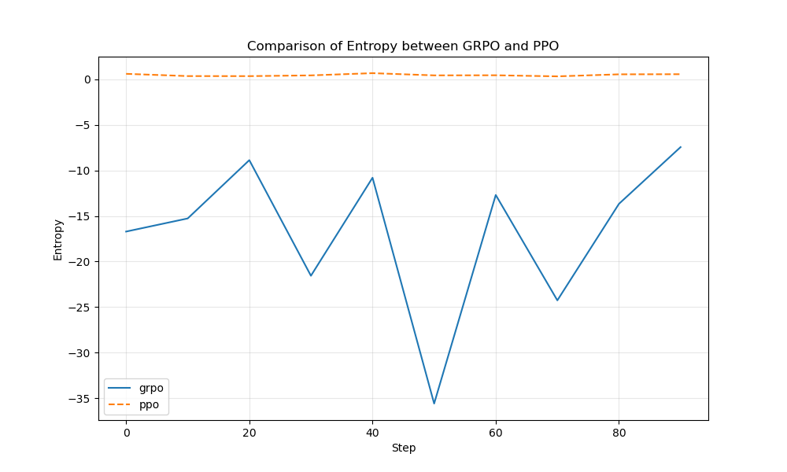

# nanoGRPO – a **tiny, from-scratch** implementation of GRPO on top of nanoGPT  
<small>Gradient-Reweighted Preference Optimisation • PyTorch ≥ 2.2 • single-GPU friendly</small>

---

## Why GRPO?

GRPO (DeepSeek-AI et al., 2025) is a lightweight alternative to PPO-RLHF:

|            | PPO-RLHF | **GRPO** |
|------------|----------|-----------|
| Models you need | 🟢 Policy<br>🟢 **Value**<br>🟢 Reward<br>🟢 Reference | 🟢 Policy<br>🟢 Reward<br>🟢 Reference |
| Advantage source | Monte-Carlo return − value | **Batch z-score of rewards** |
| GPU RAM | 4× policy size | **≈½ PPO** |
| Sample efficiency | Good | Slightly better (one pass per batch) |

The craft is in computing a **stable, unbiased policy gradient** without the extra value network.  
That's what `grpo.py` demonstrates in ≤ 40 lines of math.

---

## Results

Here are the comparison plots showing the performance of GRPO vs PPO:

### Reward Comparison


### KL Divergence Comparison


### Entropy Comparison


### Loss Comparison


---

## File map (minimal subset)

grpo.py            # <- core loss  (token-level)
train_grpo.py      # driver: SFT->GRPO
reward_model.py    # tiny GPT-style scalar RM
ppo.py, train_ppo  # side-by-side PPO baseline
clip_grpo.py       # apply GRPO to finetune CLIP models
gpu_example.py     # GPU-accelerated GRPO training
utils/metrics.py   # CSV logger
utils/plot_metrics # reward / entropy / |adv| curves

`train_grpo.py` expects you already ran nanoGPT's **SFT** step, producing a `policy.pth` that doubles as the *reference* π₀.

---

## Implementation Nuances  🚧

| Pitfall | Where it lives | What we do |
|---------|----------------|------------|
| **KL term calculation** | `grpo.py` line 17 | We use the cheap "sequence KL": `KL ≈ logp_tokens.sum(-1) – logp_ref` (with logp_ref detached). This is fast but an approximation to the true token-level KL. For variable-length completions, normalize by sequence length or apply a mask so long answers don't dominate the KL. |
| **Entropy calculation** | `grpo.py` lines 11-14 | The implemented entropy is a proxy based on sampled tokens only (`logp.exp()`). This underestimates true entropy and is kept for *logging only*. The entropy graph shows a lower bound. If you later want an entropy bonus in the loss, compute it from full logits instead. |
| **Length bias** | `kl = … logp_tokens.sum(-1)` | Summing log-probs favors long completions. For variable-length tasks, pass a mask or divide by sequence length *T*. The Shakespeare toy example uses fixed length, so it's fine by default. |
| **Detached reference** | `logp_ref = … with torch.no_grad()` | We add `.detach()` inside the KL line to ensure gradients don't leak into the frozen π₀ weights, which would cause training to explode. |
| **Zero-variance rewards** | `adv = (r-μ)/(σ+ε)` | Early batches can have identical rewards (std=0). We use a tiny `eps=1e-8` to avoid NaNs and wrap in `torch.nan_to_num` for extra safety. |
| **PPO simplifications** | `ppo.py` | Our PPO baseline intentionally omits some standard features. It bootstraps returns directly from the reward model without GAE/discounting, which slightly handicaps it versus standard implementations. This is intentional for simplicity in toy examples but worth noting for production use. |

## Plot Improvements 🖼️

For better visualization:
- Add axis labels to the plot PNGs so they remain self-describing when shared out of context
- For entropy plots, remember they show a lower bound (sampled-token entropy)
- CSV headers are aligned with plot scripts for easy experimentation

---

## Quick start (tiny Shakespeare)

```bash
git clone https://github.com/asimkadav/nanogrpo.git && cd nanogrpo
pip install torch>=2.2 pandas matplotlib

# Run the demo script to see GRPO in action
python rlhf_demo.py

# Or try the full example
python run_example.py
```

### Or if you want to run individual steps:

```bash
# 1️⃣ Generate training data
python simple_example.py

# 2️⃣ Train with GRPO
python train_grpo.py

# 3️⃣ Train with PPO (for comparison)
python train_ppo.py

# 4️⃣ Plot learning curves
python plot.py --metric mean_r logs/grpo.csv logs/ppo.csv
python plot.py --metric kl logs/grpo.csv logs/ppo.csv
python plot.py --metric entropy logs/grpo.csv logs/ppo.csv
```

## GPU Acceleration 🚀

nanoGRPO fully supports GPU acceleration for faster training:

```bash
# Install requirements with GPU support
pip install -r requirements.txt

# Run the GPU-accelerated example
python gpu_example.py --device cuda --steps 200

# Fall back to CPU if needed
python gpu_example.py --device cpu --steps 100
```

Key GPU features:
- Automatic device selection (falls back to CPU if CUDA unavailable)
- Performance timing with CUDA events
- Gradient clipping for numerical stability
- Models are automatically moved to the specified device
- Larger batch sizes for better GPU utilization

For multi-GPU training, simply instantiate separate models on different devices and gather gradients.

## CLIP Training with GRPO 🖼️📝

You can also use GRPO to finetune CLIP models, improving visual-text alignment:

```bash
# Install dependencies
pip install -r requirements.txt

# Train CLIP with GRPO on CIFAR-100
python clip_grpo.py --model-name "ViT-B/32" --dataset cifar100 --device cuda

# For CPU-only training
python clip_grpo.py --model-name "ViT-B/32" --dataset cifar100 --device cpu

# More options
python clip_grpo.py --help
```

Key features of CLIP-GRPO training:
- Freezes the text encoder as a reference model
- Finetunes only the visual encoder using GRPO
- Uses classification accuracy as the reward signal
- Applies KL regularization to prevent too much drift from original CLIP
- Supports both CIFAR-100 and ImageNet datasets
- Automatic fallback to CPU if CUDA is not available

---

## Dependencies

See `requirements.txt` for full dependencies. Core requirements:
- PyTorch ≥ 2.2
- CLIP (OpenAI's implementation)
- torchvision
- numpy/pandas/matplotlib for data handling and visualization

---

## Reading list
- DeepSeek-AI et al., "DeepSeek-R1: Incentivizing Reasoning Capability in LLMs via Reinforcement Learning," [arXiv:2501.12948](https://arxiv.org/abs/2501.12948) (2025)
- Original blog: "Why GRPO Is Important and How It Works," Oxen.ai, Feb 2025
- DeepSeek-R1 code drop – real-world GRPO implementation in the wild

---

Pull requests & issues welcome — enjoy hacking!